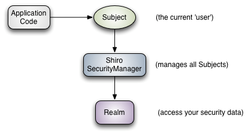

## **权限管理**

### what？

只要有用户参与的系统一般都要有权限管理**，权限管理实现对用户访问系统的控制，按照安全规则或者安全策略**控制用户可以访问而且只能访问自己被授权的资源。

对权限的管理又分为两大类别：

- **用户认证**：**用户去访问系统，系统要验证用户身份的合法性**
  - 当我们输入了自己的淘宝的账户和密码，才能打开购物车
- **用户授权**：**简单理解为访问控制**，在用户认证通过后，**系统对用户访问资源进行控制，用户具有资源的访问权限方可访问**。

用户认证的流程：

- **判断该资源能否不认证就能访问【登陆页面、首页】**

- **如果该资源需要认证后才能访问，那么判断该访问者是否认证了**

- **如果还没有认证，那么需要返回到【登陆页面】进行认证**

- **认证通过后才能访问资源**

  

  用户授权的流程

  - 到达了用户授权环节，当然是需要用户认证之后了

  - **用户访问资源，系统判断该用户是否有权限去操作该资源**

  - **如果该用户有权限才能够访问，如果没有权限就不能访问了**

    
##权限管理模型

在权限认证中，最核心的三个要素是：权限、角色和用户。

权限（Permission）：即操作资源的权利，比如访问某个页面，以及对某个模块的数据进行添加、修改、删除、查看操作的权利。
角色（Role）：指的是用户担任的角色，一个角色可以有多个权限。角色代表了操作集合，可以理解为权限的集合，一般情况下我们会赋予用户角色而不是权限，即这样用户可以拥有一组权限，赋予权限时比较方便。典型的如：项目经理、技术总监、CTO、开发工程师等都是角色，不同的角色拥有一组不同的权限。
用户（User）：在 Shiro 中，代表访问系统的用户，即下面提到的 Subject 认证主体。

它们之间的的关系可以用下图来表示：


一个用户可以有多个角色，而不同的角色可以有不同的权限，也可有相同的权限。比如说现在有三个角色，1 是普通角色，2 也是普通角色，3 是管理员，角色 1 只能查看信息，角色 2 只能添加信息，管理员对两者皆有权限，而且还可以删除信息。

- 用户（账号、密码，盐值，姓名）

- 资源（资源名称、访问地址）

- 权限（权限名称、资源id）

- 角色（角色名称，描述）

- 角色和权限关系（角色id、权限id）

- 用户和角色关系（用户id、角色id）

  

　

通常企业开发中将资源和权限表合并为一张权限表，如下：

- 资源（资源名称、访问地址）
- 权限（权限名称、资源id）

合并为：

- **权限（权限名称、资源名称、资源访问地址）**

  因此最后只剩下：

  用户（账号、密码，盐值，姓名）

  角色（角色名称，描述）

  权限（权限描述、资源名称、资源访问地址）

  角色和权限关系（角色id、权限id）

  用户和角色关系（用户id、角色id）

  

  


​	根据以上的信息可以生成user_info（用户信息表）、sys_role（角色表）、sys_permission（权限表）、sys_user_role（用户角色表）、sys_role_permission（角色权限表）这五张表。

​	shiro是apache的一个开源框架，**是一个权限管理的框架，实现 用户认证、用户授权**。相比较 Spring Security，Shiro 小巧的多。Shiro 可以非常容易的开发出足够好的应用，其不仅可以用在 JavaSE 环境，也可以用在 JavaEE 环境。Shiro 可以帮助我们完成：认证、授权、加密、会话管理、与 Web 集成、缓存等。这不就是我们想要的嘛，而且 Shiro 的 API 也是非常简单。

### why？

在使用URL拦截的时候，**要将所有的URL都配置起来，繁琐、不易维护**

而我们的Shiro实现**系统的权限管理，有效提高开发效率，从而降低开发成本。**

## 名词解释





可以看到：应用代码直接交互的对象是 Subject，也就是说 Shiro 的对外 API 核心就是 Subject；

其每个 API 的含义：

**Subject**：主体，代表了当前 “用户”，这个用户不一定是一个具体的人，与当前应用交互的任何东西都是 Subject，如网络爬虫，机器人等；即一个抽象概念；所有 Subject 都绑定到 SecurityManager，与 Subject 的所有交互都会委托给 SecurityManager；可以把 Subject 认为是一个门面；SecurityManager 才是实际的执行者；

**SecurityManager**：安全管理器；即所有与安全有关的操作都会与 SecurityManager 交互；且它管理着所有 Subject；可以看出它是 Shiro 的核心，它负责与后边介绍的其他组件进行交互，如果学习过 SpringMVC，你可以把它看成 DispatcherServlet 前端控制器；

**Realm**：域，Shiro 从从 Realm 获取安全数据（如用户、角色、权限），就是说 SecurityManager 要验证用户身份，那么它需要从 Realm 获取相应的用户进行比较以确定用户身份是否合法；也需要从 Realm 得到用户相应的角色 / 权限进行验证用户是否能进行操作；可以把 Realm 看成 DataSource，即安全数据源。

也就是说对于我们而言，最简单的一个 Shiro 应用：

1. 应用代码通过 Subject 来进行认证和授权，而 Subject 又委托给 SecurityManager；
2. 我们需要给 Shiro 的 SecurityManager 注入 Realm，从而让 SecurityManager 能得到合法的用户及其权限进行判断。

**从以上也可以看出，Shiro 不提供维护用户 / 权限，而是通过 Realm 让开发人员自己注入。**

### Shiro 身份和权限认证（简单版）


从图中可以看到，这个过程包括五步。

Step1：应用程序代码调用 Subject.login(token) 方法后，传入代表最终用户身份的 AuthenticationToken 实例 Token。

Step2：将 Subject 实例委托给应用程序的 SecurityManager（Shiro 的安全管理）并开始实际的认证工作。这里开始了真正的认证工作。

Step3、4、5：SecurityManager 根据具体的 Realm 进行安全认证。从图中可以看出，Realm 可进行自定义（Custom Realm）。

### （复杂版）

接下来我们来从 Shiro 内部来看下 Shiro 的架构，如下图所示：


**Subject**：主体，可以看到主体可以是任何可以与应用交互的 “用户”；

**SecurityManager**：相当于 SpringMVC 中的 DispatcherServlet 或者 Struts2 中的 FilterDispatcher；是 Shiro 的心脏；所有具体的交互都通过 SecurityManager 进行控制；它管理着所有 Subject、且负责进行认证和授权、及会话、缓存的管理。

**Authenticator**：认证器，负责主体认证的，这是一个扩展点，如果用户觉得 Shiro 默认的不好，可以自定义实现；其需要认证策略（Authentication Strategy），即什么情况下算用户认证通过了；

**Authrizer**：授权器，或者访问控制器，用来决定主体是否有权限进行相应的操作；即控制着用户能访问应用中的哪些功能；

**Realm**：可以有 1 个或多个 Realm，可以认为是安全实体数据源，即用于获取安全实体的；可以是 JDBC 实现，也可以是 LDAP 实现，或者内存实现等等；由用户提供；注意：Shiro 不知道你的用户 / 权限存储在哪及以何种格式存储；所以我们一般在应用中都需要实现自己的 Realm；

**SessionManager**：如果写过 Servlet 就应该知道 Session 的概念，Session 呢需要有人去管理它的生命周期，这个组件就是 SessionManager；而 Shiro 并不仅仅可以用在 Web 环境，也可以用在如普通的 JavaSE 环境、EJB 等环境；所有呢，Shiro 就抽象了一个自己的 Session 来管理主体与应用之间交互的数据；这样的话，比如我们在 Web 环境用，刚开始是一台 Web 服务器；接着又上了台 EJB 服务器；这时想把两台服务器的会话数据放到一个地方，这个时候就可以实现自己的分布式会话（如把数据放到 Memcached 服务器）；

**SessionDAO**：DAO 大家都用过，数据访问对象，用于会话的 CRUD，比如我们想把 Session 保存到数据库，那么可以实现自己的 SessionDAO，通过如 JDBC 写到数据库；比如想把 Session 放到 Memcached 中，可以实现自己的 Memcached SessionDAO；另外 SessionDAO 中可以使用 Cache 进行缓存，以提高性能；

**CacheManager**：缓存控制器，来管理如用户、角色、权限等的缓存的；因为这些数据基本上很少去改变，放到缓存中后可以提高访问的性能

**Cryptography**：密码模块，Shiro 提高了一些常见的加密组件用于如密码加密 / 解密的。

## SpringBoot +Thymeleaf +  Spring data JPA + Shiro 

## Shiro 权限认证（简单例子）


1.创建一个springboot项目，按上图勾选依赖;

```xml
<?xml version="1.0" encoding="UTF-8"?>
<project xmlns="http://maven.apache.org/POM/4.0.0" xmlns:xsi="http://www.w3.org/2001/XMLSchema-instance"
         xsi:schemaLocation="http://maven.apache.org/POM/4.0.0 https://maven.apache.org/xsd/maven-4.0.0.xsd">
    <modelVersion>4.0.0</modelVersion>
    <parent>
        <groupId>org.springframework.boot</groupId>
        <artifactId>spring-boot-starter-parent</artifactId>
        <version>2.1.9.RELEASE</version>
        <relativePath/> <!-- lookup parent from repository -->
    </parent>
    <groupId>cn.fxm.study</groupId>
    <artifactId>shiro</artifactId>
    <version>0.0.1-SNAPSHOT</version>
    <name>shiro</name>
    <description>Demo project for Spring Boot</description>


    <properties>
        <java.version>1.8</java.version>
    </properties>

    <dependencies>
        <dependency>
            <groupId>org.springframework.boot</groupId>
            <artifactId>spring-boot-starter-data-jpa</artifactId>
        </dependency>
        <dependency>
            <groupId>org.springframework.boot</groupId>
            <artifactId>spring-boot-starter-web</artifactId>
        </dependency>
        <dependency>
            <groupId>org.springframework.boot</groupId>
            <artifactId>spring-boot-starter-thymeleaf</artifactId>
        </dependency>

        <dependency>
            <groupId>mysql</groupId>
            <artifactId>mysql-connector-java</artifactId>
            <scope>runtime</scope>
        </dependency>
        <dependency>
            <groupId>org.projectlombok</groupId>
            <artifactId>lombok</artifactId>
            <optional>true</optional>
        </dependency>
        <dependency>
            <groupId>org.springframework.boot</groupId>
            <artifactId>spring-boot-starter-test</artifactId>
            <scope>test</scope>
        </dependency>
        <dependency>
            <groupId>commons-logging</groupId>
            <artifactId>commons-logging</artifactId>
            <version>1.1.3</version>
        </dependency>
        <dependency>
            <groupId>org.apache.shiro</groupId>
            <artifactId>shiro-spring</artifactId>
            <version>1.4.0</version>
        </dependency>
    </dependencies>

    <build>
        <plugins>
            <plugin>
                <groupId>org.springframework.boot</groupId>
                <artifactId>spring-boot-maven-plugin</artifactId>
            </plugin>
        </plugins>
    </build>

</project>

```

2.在resources文件夹下新建realm文件：shiro-realm.ini

```ini
#用户
[users]
#用户zhang的密码是123，此用户具有role1和role2两个角色
zhang=123,role1,role2
wang=123,role2

#角色
[roles]
#角色role1对资源user拥有create、update权限
role1=user:create,user:update
#角色role2对资源user拥有create、delete权限
role2=user:create,user:delete
#角色role3对资源user拥有create权限
role3=user:create

#权限标识符号规则：资源:操作:实例(中间使用半角:分隔)
user：create:01  表示对用户资源的01实例进行create操作。
user:create：表示对用户资源进行create操作，相当于user:create:*，对所有用户资源实例进行create操作。
user：*：01  表示对用户资源实例01进行所有操作。
```

3.测试：

Shiro支持的授权方式:

```java
Shiro 支持三种方式的授权：
编程式：通过写if/else 授权代码块完成：
Subject subject = SecurityUtils.getSubject();
if(subject.hasRole(“admin”)) {
//有权限
} else {
//无权限
}
注解式：通过在执行的Java方法上放置相应的注解完成：
@RequiresRoles("admin")
public void hello() {
//有权限
}
JSP/GSP 标签：在JSP/GSP 页面通过相应的标签完成：
<shiro:hasRole name="admin">
<!— 有权限—>
</shiro:hasRole>
```

####使用编程式授权：

```java
package cn.fxm.study.shiro;

import org.apache.shiro.SecurityUtils;
import org.apache.shiro.authc.AuthenticationException;
import org.apache.shiro.authc.UsernamePasswordToken;
import org.apache.shiro.config.IniSecurityManagerFactory;
import org.apache.shiro.mgt.SecurityManager;
import org.apache.shiro.subject.Subject;
import org.junit.Test;
import org.junit.runner.RunWith;
import org.springframework.boot.test.context.SpringBootTest;
import org.springframework.test.context.junit4.SpringRunner;

import java.util.Arrays;

@RunWith(SpringRunner.class)
@SpringBootTest
public class ShiroApplicationTests {
// 角色授权、资源授权测试
@Test
public void testAuthorization() {

    // 创建SecurityManager工厂
    IniSecurityManagerFactory factory = new IniSecurityManagerFactory(
            "classpath:shiro-realm.ini");

    // 创建SecurityManager
    SecurityManager securityManager = factory.getInstance();

    // 将SecurityManager设置到系统运行环境，和spring后将SecurityManager配置spring容器中，一般单例管理
    SecurityUtils.setSecurityManager(securityManager);

    // 创建subject
    Subject subject = SecurityUtils.getSubject();

    // 创建token令牌
    UsernamePasswordToken token = new UsernamePasswordToken("zhang",
            "123");

    // 执行认证
    try {
        subject.login(token);
    } catch (AuthenticationException e) {
        // TODO Auto-generated catch block
        e.printStackTrace();
    }

    System.out.println("认证状态：" + subject.isAuthenticated());
    // 认证通过后执行授权

    // 基于角色的授权
    // hasRole传入角色标识
    boolean ishasRole = subject.hasRole("role1");
    System.out.println("单个角色判断" + ishasRole);
    // hasAllRoles是否拥有多个角色
    boolean hasAllRoles = subject.hasAllRoles(Arrays.asList("role1",
            "role2", "role3"));
    System.out.println("多个角色判断" + hasAllRoles);

    // 使用check方法进行授权，如果授权不通过会抛出异常
    // subject.checkRole("role13");

    // 基于资源的授权
    // isPermitted传入权限标识符
    boolean isPermitted = subject.isPermitted("user:create:1");
    System.out.println("单个权限判断" + isPermitted);

    boolean isPermittedAll = subject.isPermittedAll("user:create:1",
            "user:delete");
    System.out.println("多个权限判断" + isPermittedAll);
    // 使用check方法进行授权，如果授权不通过会抛出异常
    subject.checkPermission("items:create:1");
    subject.checkPermission("user:create:1");
}
}

```


## Shiro 权限认证2（复杂例子）

1.配置数据库的基本信息：application.yml

```yml
spring:
  datasource:
    url: jdbc:mysql://localhost:3306/test
    username: root
    password: 123456
    driver-class-name: com.mysql.jdbc.Driver
  jpa:
    show-sql: true #控制台打印sql
    hibernate:
      ddl-auto: update #建表策略，这里用update，即根据实体更新表结构
    database: mysql #指定数据库类型
    database-platform: org.hibernate.dialect.MySQL5InnoDBDialect
    open-in-view: true

  thymeleaf:
    cache: false
    mode: LEGACYHTML5

```

3.创建bean包

实体类：UserInfo

```java
package cn.fxm.study.shiro.bean;

import cn.fxm.study.shiro.bean.SysRole;
import com.fasterxml.jackson.annotation.JsonIgnoreProperties;
import lombok.Data;

import javax.persistence.*;
import java.util.List;

@Data
@Entity
public class UserInfo {
    @Id
    @GeneratedValue
    private Long id; // 主键.
    @Column(unique = true)
    private String username; // 登录账户,唯一.
    private String name; // 名称(匿名或真实姓名),用于UI显示
    private String password; // 密码.
    private String salt; // 加密密码的盐
    @JsonIgnoreProperties(value = {"userInfos"})
    @ManyToMany(fetch = FetchType.EAGER) // 立即从数据库中进行加载数据
    @JoinTable(name = "SysUserRole", joinColumns = @JoinColumn(name = "uid"), inverseJoinColumns = @JoinColumn(name = "roleId"))
    private List<SysRole> roles; // 一个用户具有多个角色

    /** getter and setter */
}
```

SysRole

```java
package cn.fxm.study.shiro.bean;

import cn.fxm.study.shiro.bean.SysPermission;
import com.fasterxml.jackson.annotation.JsonIgnoreProperties;
import lombok.Data;

import javax.persistence.*;
import java.util.List;
@Data
@Entity
public class SysRole {
    @Id
    @GeneratedValue
    private Long id; // 主键.
    private String name; // 角色名称,如 admin/user
    private String description; // 角色描述,用于UI显示

    // 角色 -- 权限关系：多对多
    @JsonIgnoreProperties(value = {"roles"})
    @ManyToMany(fetch = FetchType.EAGER)
    @JoinTable(name = "SysRolePermission", joinColumns = {@JoinColumn(name = "roleId")}, inverseJoinColumns = {@JoinColumn(name = "permissionId")})
    private List<SysPermission> permissions;

    // 用户 -- 角色关系：多对多
    @JsonIgnoreProperties(value = {"roles"})
    @ManyToMany
    @JoinTable(name = "SysUserRole", joinColumns = {@JoinColumn(name = "roleId")}, inverseJoinColumns = {@JoinColumn(name = "uid")})
    private List<UserInfo> userInfos;// 一个角色对应多个用户

    public SysRole() {
    }

    /** getter and setter */
}
```

  SysPermission

```JAVA
package cn.fxm.study.shiro.bean;
import com.fasterxml.jackson.annotation.JsonIgnoreProperties;
import lombok.Data;

import javax.persistence.*;
import java.util.List;
@Data
@Entity
public class SysPermission {
    @Id
    @GeneratedValue
    private Long id; // 主键.
    private String name; // 权限名称,如 user:select
    private String description; // 权限描述,用于UI显示
    private String url; // 权限地址.
    @JsonIgnoreProperties(value = {"permissions"})
    @ManyToMany
    @JoinTable(name = "SysRolePermission", joinColumns = {@JoinColumn(name = "permissionId")}, inverseJoinColumns = {@JoinColumn(name = "roleId")})
    private List<SysRole> roles; // 一个权限可以被多个角色使用

    /** getter and setter */
}
```

​		由于一个用户拥有多个角色，一个角色又拥有多个权限，而权限跟角色也是多对多的关系，也就是造成了 查用户→查角色→查权限→查角色→查用户... 这样的无限循环，导致传输错误，所以我们根据这样的逻辑在每一个实体类返回JSON时使用了一个`@JsonIgnoreProperties`注解，来排除自己对自己无限引用的过程，也就是打断这样的无限循环。

​		根据以上的代码会自动生成user_info（用户信息表）、sys_role（角色表）、sys_permission（权限表）、sys_user_role（用户角色表）、sys_role_permission（角色权限表）这五张表，为了方便测试我们给这五张表插入一些初始化数据：

```sql
insert into `test`.`user_info` ( `id`, `name`, `password`, `salt`, `username`) values ( '1', '管理员', 'b1c17d858c9b4f2940fab3f2b34f23ab', '18034a2cb955e302f40957dcf067b688', 'wmyskxz');
INSERT INTO `sys_permission` (`id`,`description`,`name`,`url`) VALUES (1,'查询用户','userInfo:view','/userList');
INSERT INTO `sys_permission` (`id`,`description`,`name`,`url`) VALUES (2,'增加用户','userInfo:add','/userAdd');
INSERT INTO `sys_permission` (`id`,`description`,`name`,`url`) VALUES (3,'删除用户','userInfo:delete','/userDelete');
INSERT INTO `sys_role` (`id`,`description`,`name`) VALUES (1,'管理员','admin');
INSERT INTO `sys_role_permission` (`permission_id`,`role_id`) VALUES (1,1);
INSERT INTO `sys_role_permission` (`permission_id`,`role_id`) VALUES (2,1);
INSERT INTO `sys_user_role` (`role_id`,`uid`) VALUES (1,1);
```
4.准备 DAO 层和 Service 层

新建dao包，service包，在dao包下新建UserInfoDao接口

```java
public interface UserInfoDao extends JpaRepository<UserInfo, Long> {
    /** 通过username查找用户信息*/
    public UserInfo findByUsername(String username);
}
```
在service包下新建UserInfoService接口，以及UserInfoService接口的实现类UserInfoServiceImpl

```java
package cn.fxm.study.shiro.service;

import cn.fxm.study.shiro.bean.UserInfo;

public interface UserInfoService {
    /** 通过username查找用户信息；*/
    public UserInfo findByUsername(String username);
}
```

```java
package cn.fxm.study.shiro.service;

import cn.fxm.study.shiro.bean.UserInfo;
import cn.fxm.study.shiro.dao.UserInfoDao;
import org.springframework.stereotype.Service;

import javax.annotation.Resource;

@Service
public class UserInfoServiceImpl implements UserInfoService {

    @Resource
    UserInfoDao userInfoDao;

    @Override
    public UserInfo findByUsername(String username) {
        return userInfoDao.findByUsername(username);
    }
}
```

5.自定义 Realm

​		有了数据库表和数据，我们开始自定义 Realm。自定义 Realm 需要继承 AuthorizingRealm 类，该类封装了很多方法，且继承自 Realm 类。

继承 AuthorizingRealm 类后，我们需要重写以下两个方法。

doGetAuthenticationInfo() 方法：用来验证当前登录的用户，获取认证信息。
doGetAuthorizationInfo() 方法：为当前登录成功的用户授予权限和分配角色。

**MyShiroRealm**

```java
package cn.fxm.study.shiro.config;

import cn.fxm.study.shiro.bean.SysPermission;
import cn.fxm.study.shiro.bean.SysRole;
import cn.fxm.study.shiro.bean.UserInfo;
import cn.fxm.study.shiro.service.UserInfoService;
import org.apache.shiro.SecurityUtils;
import org.apache.shiro.authc.AuthenticationException;
import org.apache.shiro.authc.AuthenticationInfo;
import org.apache.shiro.authc.AuthenticationToken;
import org.apache.shiro.authc.SimpleAuthenticationInfo;
import org.apache.shiro.authz.AuthorizationInfo;
import org.apache.shiro.authz.SimpleAuthorizationInfo;
import org.apache.shiro.realm.AuthorizingRealm;
import org.apache.shiro.subject.PrincipalCollection;
import org.apache.shiro.util.ByteSource;

import javax.annotation.Resource;

public class MyShiroRealm extends AuthorizingRealm {

    @Resource
    private UserInfoService userService;

    ///授权
    @Override
    protected AuthorizationInfo doGetAuthorizationInfo(PrincipalCollection principalCollection) {
        // 获取用户基本信息
        //如果身份认证的时候没有传入User对象，这里只能取到userName
        //也就是SimpleAuthenticationInfo构造的时候第一个参数传递需要User对象
        UserInfo userInfo = (UserInfo) principalCollection.getPrimaryPrincipal();
        SimpleAuthorizationInfo simpleAuthorizationInfo = new SimpleAuthorizationInfo();
        for (SysRole role : userInfo.getRoles()) {
            simpleAuthorizationInfo.addRole(role.getName());
            for (SysPermission permission : role.getPermissions()) {
                simpleAuthorizationInfo.addStringPermission(permission.getName());
            }
        }
        return simpleAuthorizationInfo;
    }

    //认证,/*主要是用来进行身份认证的，也就是说验证用户输入的账号和密码是否正确。*/
    @Override
    protected AuthenticationInfo doGetAuthenticationInfo(AuthenticationToken authenticationToken) throws AuthenticationException {
        // 根据 Token 获取用户名，//获取用户的输入的账号.
        String username = (String) authenticationToken.getPrincipal();
        // 根据用户名从数据库中查询该用户
        UserInfo user = userService.findByUsername(username);
        if (user != null) {
            // 把当前用户存到 Session 中
            SecurityUtils.getSubject().getSession().setAttribute("user", user);
            // 传入用户名和密码进行身份认证，并返回认证信息
            AuthenticationInfo authcInfo = new SimpleAuthenticationInfo(
            user, //这里传入的是user对象，比对的是用户名，直接传入用户名也没错，但是在授权部分就需要自己重新从数据库里取权限
                    user.getPassword(), //密码
                    ByteSource.Util.bytes(user.getSalt()),//
                    getName()); //realm name
            return authcInfo;
        } else {
            return null;
        }
    }

}
```

##### 6.Shiro 配置

自定义 Realm 写好了，接下来需要配置 Shiro。我们主要配置以下几个东西：自定义 Realm、安全管理器 SecurityManager ,Shiro 过滤器,凭证匹配器，开启shiro aop注解支持。

 ShiroConfig

```java
package cn.fxm.study.shiro.config;

import lombok.extern.slf4j.Slf4j;
import org.apache.shiro.authc.credential.HashedCredentialsMatcher;
import org.apache.shiro.spring.security.interceptor.AuthorizationAttributeSourceAdvisor;
import org.apache.shiro.spring.web.ShiroFilterFactoryBean;
import org.apache.shiro.web.mgt.DefaultWebSecurityManager;
import org.springframework.context.annotation.Bean;
import org.springframework.context.annotation.Configuration;
import org.apache.shiro.mgt.SecurityManager;
import org.springframework.web.servlet.handler.SimpleMappingExceptionResolver;

import java.util.LinkedHashMap;
import java.util.Map;
import java.util.Properties;

@Slf4j
@Configuration
public class ShiroConfig {
    /**
     * 注入自定义的 Realm
     * @return MyRealm
     */
    @Bean
    public MyShiroRealm myAuthRealm() {
        MyShiroRealm myShiroRealm = new MyShiroRealm();
        myShiroRealm.setCredentialsMatcher(hashedCredentialsMatcher());
        log.info("====MyShiroRealm注册完成=====");
        return myShiroRealm;
    }
    /**
     * 注入安全管理器
     * @return SecurityManager
     */
    @Bean
    public DefaultWebSecurityManager securityManager() {
        // 将自定义 Realm 加进来
        DefaultWebSecurityManager securityManager = new DefaultWebSecurityManager(myAuthRealm());
        log.info("====securityManager注册完成====");
        return securityManager;
    }
    /**
     * 注入 Shiro 过滤器
     * @param securityManager 安全管理器
     * @return ShiroFilterFactoryBean
     */
    @Bean
    public ShiroFilterFactoryBean shiroFilter(SecurityManager securityManager) {
        // 定义 shiroFactoryBean
        ShiroFilterFactoryBean shiroFilterFactoryBean=new ShiroFilterFactoryBean();

        // 设置自定义的 securityManager
        shiroFilterFactoryBean.setSecurityManager(securityManager);

        // 设置默认登录的 URL，身份认证失败会访问该 URL
        shiroFilterFactoryBean.setLoginUrl("/login");
        // 设置成功之后要跳转的链接
        shiroFilterFactoryBean.setSuccessUrl("/index");
        // 设置未授权界面，权限认证失败会访问该 URL
        shiroFilterFactoryBean.setUnauthorizedUrl("/403");

        // LinkedHashMap 是有序的，进行顺序拦截器配置
        Map<String,String> filterChainMap = new LinkedHashMap<>();

        // 配置可以匿名访问的地址，可以根据实际情况自己添加，放行一些静态资源等，anon 表示放行
        //拦截器.
        Map<String,String> filterChainDefinitionMap = new LinkedHashMap<String,String>();
        // 配置不会被拦截的链接 顺序判断，因为前端模板采用了thymeleaf，
        // 这里不能直接使用 ("/static/**", "anon")来配置匿名访问，必须配置到每个静态目录
        filterChainMap.put("/css/**", "anon");
        filterChainMap.put("/imgs/**", "anon");
        filterChainMap.put("/js/**", "anon");
        filterChainMap.put("/swagger-*/**", "anon");
        filterChainMap.put("/swagger-ui.html/**", "anon");
        // 配置不会被拦截的链接 顺序判断
        // 登录 URL 放行
        filterChainMap.put("/login", "anon");

        // 以“/user/admin” 开头的用户需要身份认证，authc 表示要进行身份认证
        filterChainMap.put("/user/admin*", "authc");
        // “/user/student” 开头的用户需要角色认证，是“admin”才允许
        filterChainMap.put("/user/student*/**", "roles[admin]");
        // “/user/teacher” 开头的用户需要权限认证，是“user:create”才允许
        filterChainMap.put("/user/teacher*/**", "perms[\"user:create\"]");

        // 配置 logout 过滤器
        filterChainMap.put("/logout", "logout");
        // <!-- 过滤链定义，从上向下顺序执行，一般将/**放在最为下边 -->:这是一个坑呢，一不小心代码就不好使了;
        // <!-- authc:所有url都必须认证通过才可以访问; anon:所有url都都可以匿名访问-->
        filterChainMap.put("/**", "authc");
        // 设置 shiroFilterFactoryBean 的 FilterChainDefinitionMap
        shiroFilterFactoryBean.setFilterChainDefinitionMap(filterChainMap);
        log.info("====shiroFilterFactoryBean注册完成====");
        return shiroFilterFactoryBean;
    }
    /**
     * 凭证匹配器
     * （由于我们的密码校验交给Shiro的SimpleAuthenticationInfo进行处理了
     *      哈希密码比较器。在myShiroRealm中作用参数使用
     *      登陆时会比较用户输入的密码，跟数据库密码配合盐值salt解密后是否一致。
     *
     *
     * @return
     */
    @Bean
    public HashedCredentialsMatcher hashedCredentialsMatcher(){
        HashedCredentialsMatcher hashedCredentialsMatcher = new HashedCredentialsMatcher();
        hashedCredentialsMatcher.setHashAlgorithmName("md5");//散列算法:这里使用MD5算法;
        hashedCredentialsMatcher.setHashIterations(2);//散列的次数，比如散列两次，相当于 md5(md5(""));
        hashedCredentialsMatcher.setStoredCredentialsHexEncoded(true);
        return hashedCredentialsMatcher;
    }

    /**
     *   开启shiro aop注解支持.
     *   使用代理方式;所以需要开启代码支持;否则@RequiresRoles等注解无法生效
     *      * @param securityManager
     *      * @return
     * @param securityManager
     * @return
     */
    @Bean
    public AuthorizationAttributeSourceAdvisor authorizationAttributeSourceAdvisor(SecurityManager securityManager){
        AuthorizationAttributeSourceAdvisor authorizationAttributeSourceAdvisor = new AuthorizationAttributeSourceAdvisor();
        authorizationAttributeSourceAdvisor.setSecurityManager(securityManager);
        return authorizationAttributeSourceAdvisor;
    }

    @Bean(name="simpleMappingExceptionResolver")
    public SimpleMappingExceptionResolver
    createSimpleMappingExceptionResolver() {
        SimpleMappingExceptionResolver r = new SimpleMappingExceptionResolver();
        Properties mappings = new Properties();
        mappings.setProperty("DatabaseException", "databaseError");//数据库异常处理
        mappings.setProperty("UnauthorizedException","403");
        r.setExceptionMappings(mappings);  // None by default
        r.setDefaultErrorView("error");    // No default
        r.setExceptionAttribute("exception");     // Default is "exception"
        //r.setWarnLogCategory("example.MvcLogger");     // No default
        return r;
    }

}

```

​		Apache Shiro 的核心通过 Filter 来实现，就好像 SpringMvc 通过 DispachServlet 来主控制一样。 既然是使用 Filter 一般也就能猜到，是通过URL规则来进行过滤和权限校验，所以我们需要定义一系列关于URL的规则和访问权限。

默认登录的 URL：身份认证失败会访问该 URL。
认证成功之后要跳转的 URL。
权限认证失败后要跳转的 URL。
需要拦截或者放行的 URL：这些都放在一个 Map 中。


7.新建【controller】包，然后在下面创建以下文件：

```java
package cn.fxm.study.shiro.controller;


import cn.fxm.study.shiro.service.UserInfoService;
import org.apache.shiro.SecurityUtils;
import org.apache.shiro.authc.AuthenticationException;
import org.apache.shiro.authc.IncorrectCredentialsException;
import org.apache.shiro.authc.UnknownAccountException;
import org.apache.shiro.authc.UsernamePasswordToken;
import org.apache.shiro.subject.Subject;
import org.springframework.beans.factory.annotation.Autowired;
import org.springframework.stereotype.Controller;
import org.springframework.ui.Model;
import org.springframework.web.bind.annotation.RequestBody;
import org.springframework.web.bind.annotation.RequestMapping;
import org.springframework.web.bind.annotation.RequestMethod;

import javax.servlet.http.HttpServletRequest;
import java.util.Map;

@Controller
public class IndexController {
    @Autowired
    UserInfoService userInfoService;

    @RequestMapping({"/","/index"})
    public String index(){
        return "index";
    }
    @RequestMapping(value = "/login",method = RequestMethod.GET)
    public String login(){
        return "login";
    }

    @RequestMapping(value = "/login",method = RequestMethod.POST)
    public String login(HttpServletRequest request, String username, String password, Model model) throws Exception{
        System.out.println("IndexController.login()");
        System.out.println("IndexController.login888()"+username +".."+password);
        UsernamePasswordToken token = new UsernamePasswordToken(username ,
                password);

        Subject currentUser = SecurityUtils.getSubject();
        try {
            //主体提交登录请求到SecurityManager
            currentUser.login(token);
        }catch (IncorrectCredentialsException ice){
            model.addAttribute("msg","密码不正确");
        }catch(UnknownAccountException uae){
            model.addAttribute("msg","账号不存在");
        }catch(AuthenticationException ae){
            model.addAttribute("msg","状态不正常");
        }
        if(currentUser.isAuthenticated()){
            System.out.println("认证成功");
            model.addAttribute("currentUser",username);
            return "index";
        }else{
            token.clear();
            return "login";
        }
    }

    @RequestMapping("/403")
    public String unauthorizedRole(){
        System.out.println("------没有权限-------");
        return "403";
    }
}
```

8.添加相关页面文件

login.html

```html
<!DOCTYPE html>
<html lang="en"
      xmlns:th="http://www.w3.org/1999/xhtml">
<head>
    <meta charset="utf-8">
    <meta http-equiv="X-UA-Compatible" content="IE=edge">
    <meta name="viewport" content="width=device-width, initial-scale=1">
    <link rel="stylesheet" href="../static/css/bootstrap.min.css" th:href="@{/css/bootstrap.min.css}"></link>


    <title>用户登录</title>

    <style>
        .bgColor{
            background-color:rgba(243,66,111,0.15)
        }
        .divBorder{
            border: solid 1px rgba(12,24,255,0.15);
            padding: 10px;
            margin-top: 10px;
            border-radius: 10px;
            text-align: center;
            vertical-align: middle;
        }
        .h4font{
            margin-top: 0px;
            font-family: 微软雅黑;
            font-weight: 500;
        }

        .center {
            padding: 20% 0;
        }


    </style>

</head>
<body>

<div class="container">
    <div class="row center">
        <div class="divBorder col-sm-offset-3 col-sm-6">
            <h3 class="panel panel-heading h4font">
                用户登录
            </h3>
            <h4 th:text="${msg}"></h4>
            <form class="form-horizontal" th:action="@{/login}" method="post">
                <div class="input-group input-group-lg">
                    <span class="input-group-addon"><i class="glyphicon glyphicon-user" aria-hidden="true"></i></span>
                    <input type="text" class="form-control" id="userName" name="username" placeholder="请输入用户名称" value="wmyskxz"/>
                </div>
                <br>
                <div class="input-group input-group-lg">
                    <span class="input-group-addon"><i class="glyphicon glyphicon-lock"></i></span>
                    <input type="password" class="form-control" id="password" name="password" placeholder="请输入密码" value="123456"/>
                </div>


                <br>
                <input type="submit" class="btn btn-lg btn-block btn-info" value="登 录">
            </form>
        </div>


    </div>

</div>

</body>
</html>
```

403.html

```html
<!DOCTYPE html>
<html lang="en">
<head>
    <meta charset="UTF-8">
    <title>Title</title>
</head>
<body>
没有权限
</body>
</html>
```

index.html

```html
<!DOCTYPE html>
<html lang="en" xmlns:th="http://www.w3.org/1999/xhtml">
<head>
    <meta charset="UTF-8">
    <title>Title</title>
</head>
<body>
这是首页,欢迎用户：
<p th:text="${currentUser}"></p>
</body>
</html>
```

9.测试访问链接http://localhost:8080/login可以正常跳转到index.html。但是控制台报错：

是关于spring data jpa 中hibernate懒加载的问题，

​    在启动类ShiroApplication中加入

```
@Bean
public OpenEntityManagerInViewFilter openEntityManagerInViewFilter(){
   return new OpenEntityManagerInViewFilter();
}
```

​     配置文件中加入 spring.jpa.open-in-view=true

继续运行，报错，关于json对象的循环引用问题，一个关于多对多无限循环的坑，比如当我们想要返回给前台一个用户信息时，由于一个用户拥有多个角色，一个角色又拥有多个权限，而权限跟角色也是多对多的关系，也就是造成了 查用户→查角色→查权限→查角色→查用户... 这样的无限循环，导致传输错误，所以我们根据这样的逻辑在每一个实体类返回JSON时使用了一个`@JsonIgnoreProperties`注解，来排除自己对自己无线引用的过程，也就是打断这样的无限循环。


在SysPermission中重写toString()方法：

```java
@Override
public String toString() {
    return "SysPermission{" +
            "id=" + id +
            ", name='" + name + '\'' +
            ", description='" + description + '\'' +
            ", url='" + url + '\'' +
            '}';
}
```

在SysRole中重写toString()方法：

```java
@Override
public String toString() {
    return "SysRole{" +
            "id=" + id +
            ", name='" + name + '\'' +
            ", description='" + description + '\'' +
            '}';
}
```

在UserInfo中重写toString()方法：

```java
@Override
public String toString() {
    return "UserInfo{" +
            "id=" + id +
            ", username='" + username + '\'' +
            ", name='" + name + '\'' +
            ", password='" + password + '\'' +
            ", salt='" + salt + '\'' +
            '}';
}
```


10.授权测试，

​	UserInfoController

```java
package cn.fxm.study.shiro.controller;

import cn.fxm.study.shiro.bean.UserInfo;
import cn.fxm.study.shiro.service.UserInfoService;
import org.apache.shiro.authz.annotation.RequiresPermissions;
import org.springframework.web.bind.annotation.*;

import javax.annotation.Resource;

@RestController
public class UserInfoController {

    @Resource
    UserInfoService userInfoService;

    /**
     * 按username账户从数据库中取出用户信息
     *
     * @param username 账户
     * @return
     */
    @GetMapping("/userList")
    @RequiresPermissions("userInfo:view") // 权限管理.
    public UserInfo findUserInfoByUsername(@RequestParam String username) {
        return userInfoService.findByUsername(username);
    }

    /**
     * 简单模拟从数据库添加用户信息成功
     *
     * @return
     */
    @PostMapping("/userAdd")
    @RequiresPermissions("userInfo:add")
    public String addUserInfo() {
        return "addUserInfo success!";
    }

    /**
     * 简单模拟从数据库删除用户成功
     *
     * @return
     */
    @DeleteMapping("/userDelete")
    @RequiresPermissions("userInfo:delete")
    public String deleteUserInfo() {
        return "deleteUserInfo success!";
    }
}
```

在用户没有登录的情况下直接访问链接，

http://localhost:8080/userList，显示的都是登录页面，因为没有认证无权限


登录一下：http://localhost:8080/login?username=wmyskxz&password=123456


上面登录成功了，访问 http://localhost:8080/userList?username=wmyskxz 查询用户信息，可以看到当前用户拥有访问/userList,/userAdd ,链接的权限。


访问 http://localhost:8080/userAdd ，模拟添加一个用户信息，成功


访问 http://localhost:8080/userDelete，模拟删除一个用户，失败，显示没有权限403页面，符合授权规则。


由于在ShiroConfig中配置了如下的内容，

```java
  // 登录 URL 放行
        filterChainMap.put("/login", "anon");

        // 以“/user/admin” 开头的用户需要身份认证，authc 表示要进行身份认证
        filterChainMap.put("/user/admin*", "authc");
        // “/user/student” 开头的用户需要角色认证，是“admin”才允许
        filterChainMap.put("/user/student*/**", "roles[admin]");
        // “/user/teacher” 开头的用户需要权限认证，是“user:create”才允许
        filterChainMap.put("/user/teacher*/**", "perms[user:create]");

        // 配置 logout 过滤器
        filterChainMap.put("/logout", "logout");
        // <!-- 过滤链定义，从上向下顺序执行，一般将/**放在最为下边 -->:这是一个坑呢，一不小心代码就不好使了;
        // <!-- authc:所有url都必须认证通过才可以访问; anon:所有url都都可以匿名访问-->
        filterChainMap.put("/**", "authc");
```

在UserInfoController中继续添加如下代码

```java
@RequestMapping("/user/admin")
public String admin(HttpServletRequest request) {
    Object user = request.getSession().getAttribute("user");
    return "success";
}

/**
 * 角色认证测试接口
 * @param request
 * @return
 */
@RequestMapping("/user/student")
public String student(HttpServletRequest request) {
    return "success";
}

/**
 * 权限认证测试接口
 * @param request
 * @return
 */
@RequestMapping("/user/teacher")
public String teacher(HttpServletRequest request) {
    return "success";
}
```

测试，再分别访问，在测试之前要先登录一下，

接口一：使用 http://localhost:8080/user/admin 进行身份认证。
接口二：使用 http://localhost:8080/user/student 进行角色认证。
接口三：使用 http://localhost:8080/user/teacher 进行权限认证。

发现接口三没有权限http://localhost:8080/user/teacher ，访问的链接需要user:create权限。


在数据库sys_permission表中添加一条user:create权限，在sys_role_permission中为role_id添加一条权限信息。

insert into `test`.`sys_permission` ( `id`, `description`, `name`, `url`) values ( '4', '创建用户', 'user:create', '/user/teacher');

insert into `test`.`sys_role_permission` ( `role_id`, `permission_id`) values ( '1', '4');

关于更多shiro权限注解可以参考：https://blog.csdn.net/w_stronger/article/details/73109248

